Create the Virtual Site
#######################

Make sure CE site is up and running
====================================

1. In the F5 XC Console select **Multi-Cloud Network Connect**:

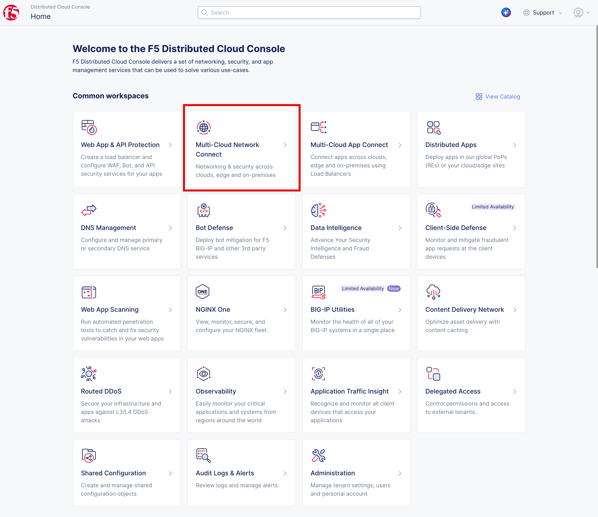

2. Make sure that the site assigned to you is up and running. Select **Site Management (1)** and then **Secure Mesh Sites v2 (2)**. 
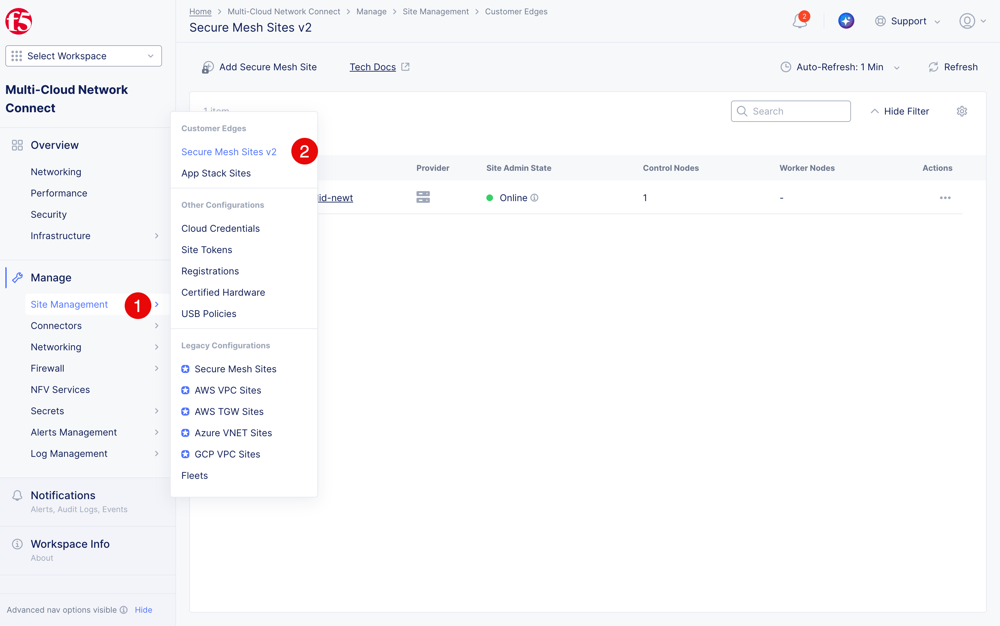

3. The site ``smsv2-$$namespace$$`` should be listed as **Online**. 
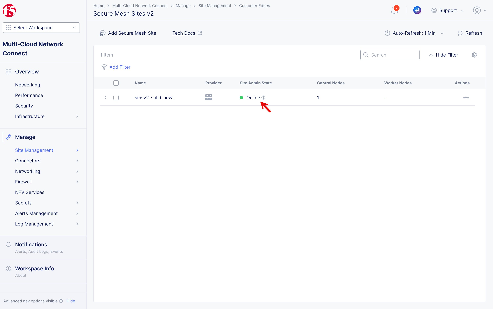

Check the label of the site. 
============================

1. Click on the **.. (1)** and select **Manage Configuration (2)**
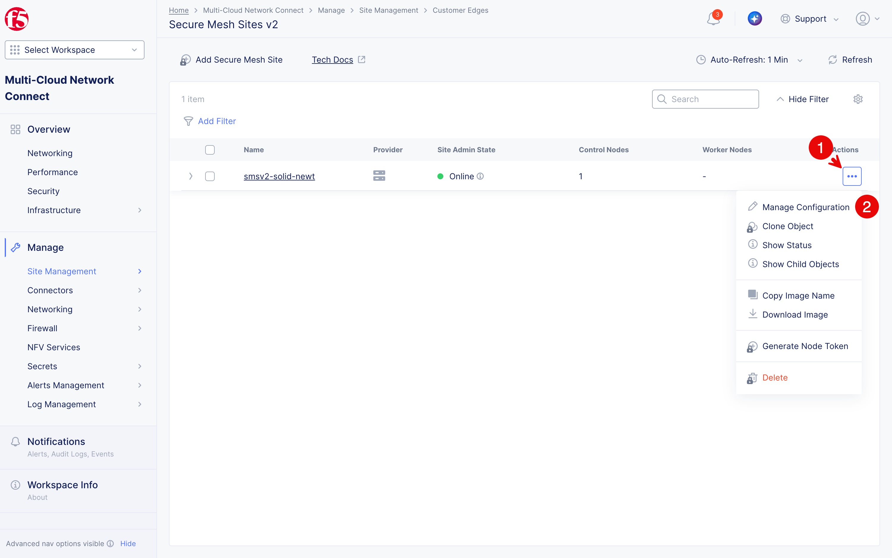

2. Make sure the site has the label ``ves.io/siteName`` with the value ``smsv2-$$namespace$$``.
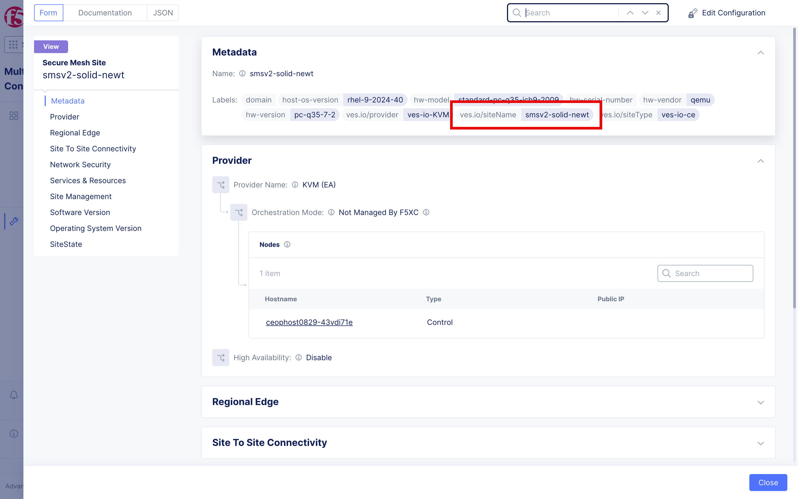

3. Click **Close (1)** to return to the list of sites.
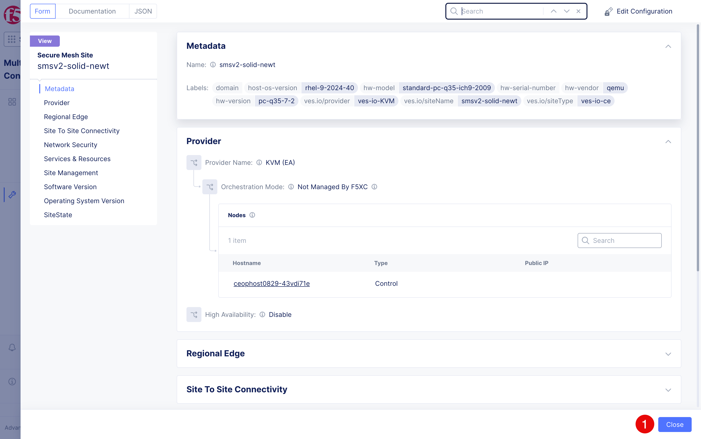

Create the Virtual Site
=======================
1. Click on **Select Workspace (1)**  and select **Distributed Apps (2)**.
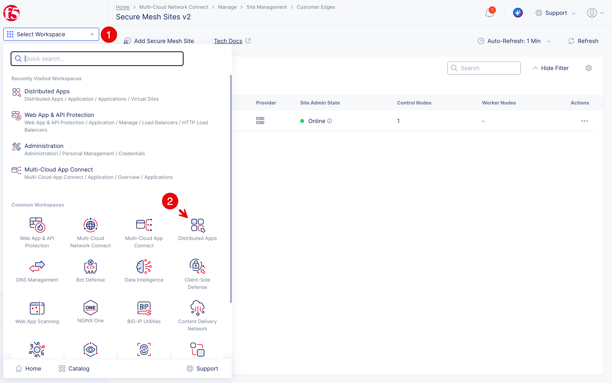

2. Select your namespace **$$namespace$$** from the drop-down list (1) if not yet selected.
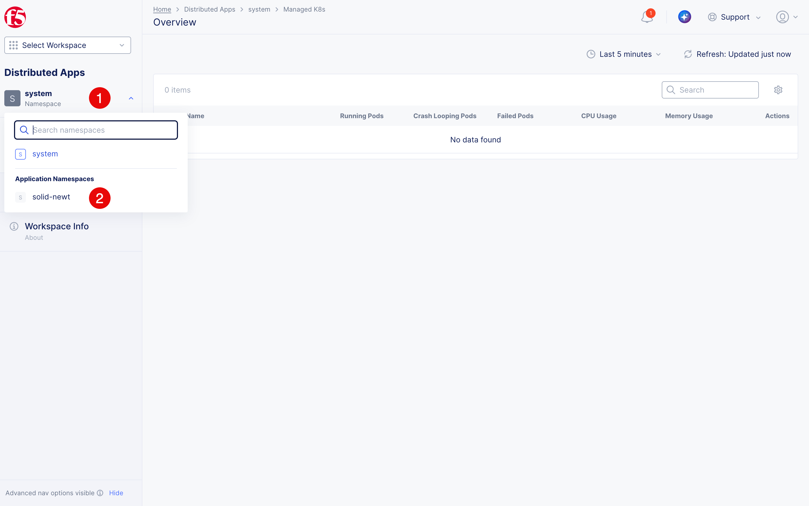

3. Open **Applications (1)** > **Virtual Sites (2)** and select **Add Virtual Site (3)**.
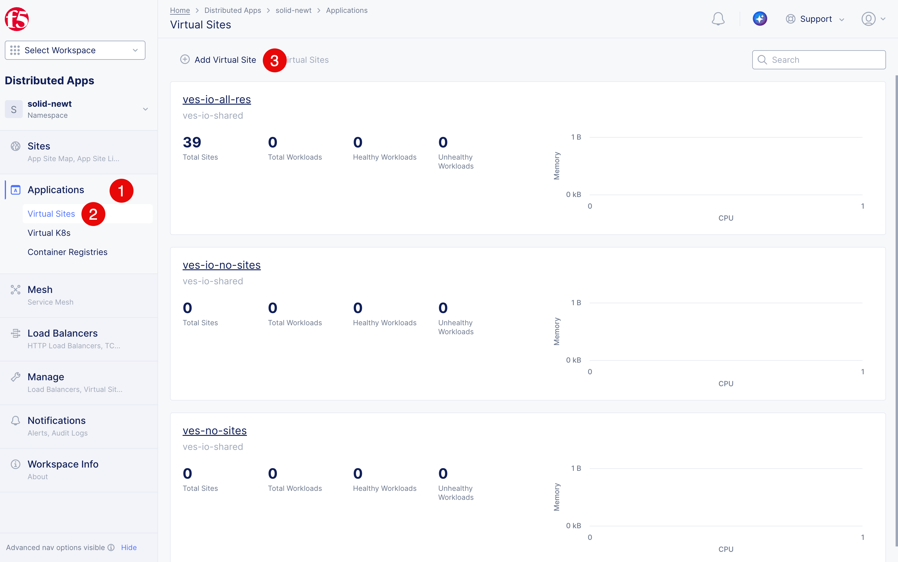

4. Enter ``arcadia-finance-vsite`` as the **Name (1)**. Select **CE** as a **Site Type (2)**. Specify ``ves.io/siteName`` as the selector, then **==** as the operator, and enter ``smsv2-$$namespace$$`` as the value (3). Click **Assign a Custom Value 'smsv2-$$namespace$$' (4)**. Click **Add Virtual Site (5)** to create the virtual site.

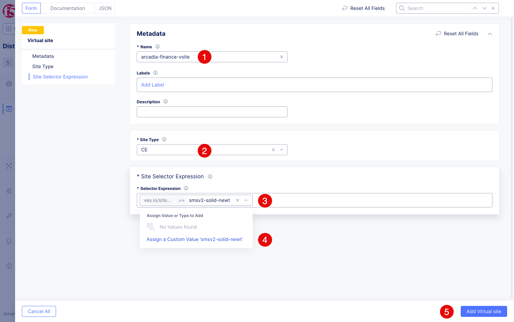

.. warning::
   Enter the selector exactly as shown and confirm that it selects only your assigned CE site. An incorrect or overly broad selector could place workloads on another student's CE site and interfere with their lab.

5. The virtual site ``arcadia-finance-vsite`` should be listed with **Total Sites** equals to 1.
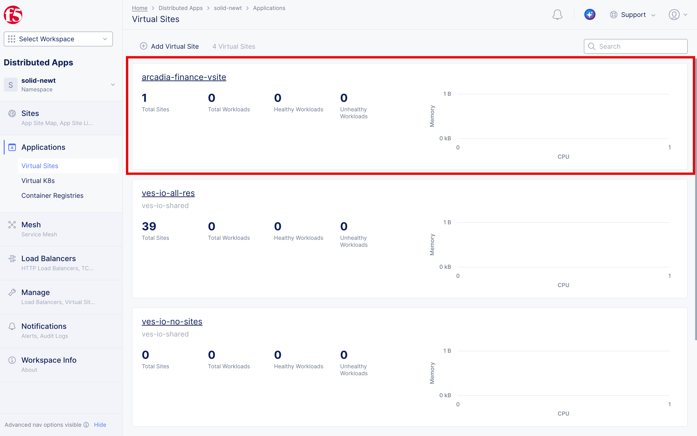

