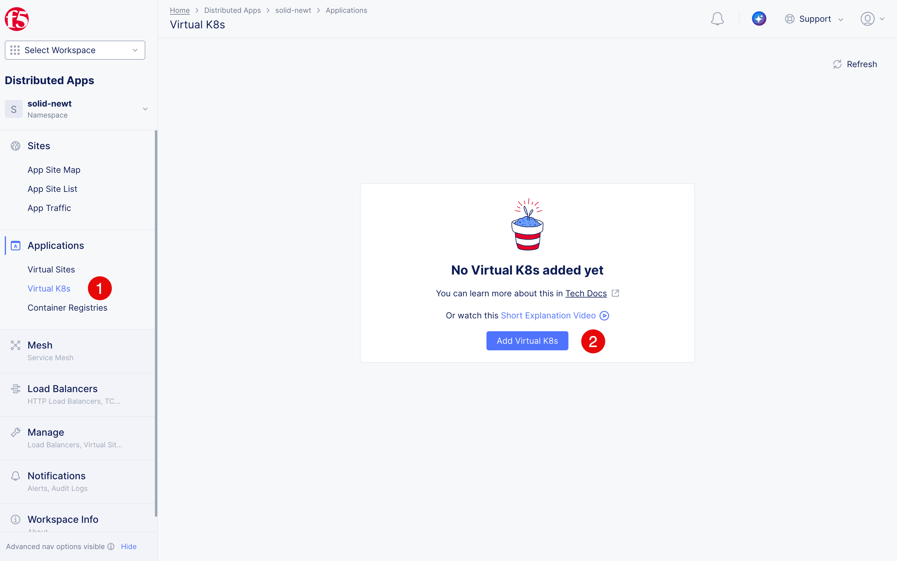
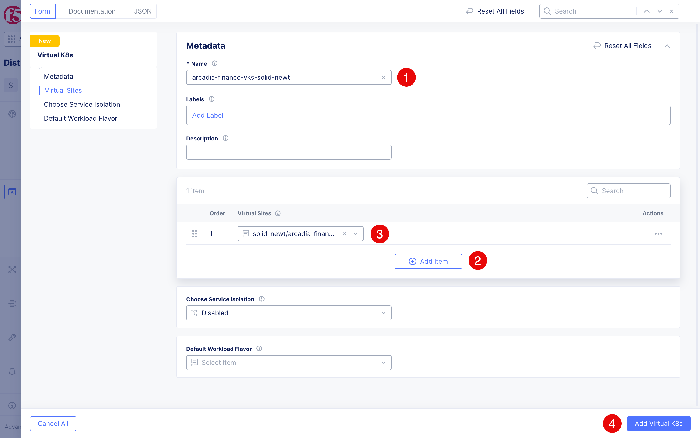
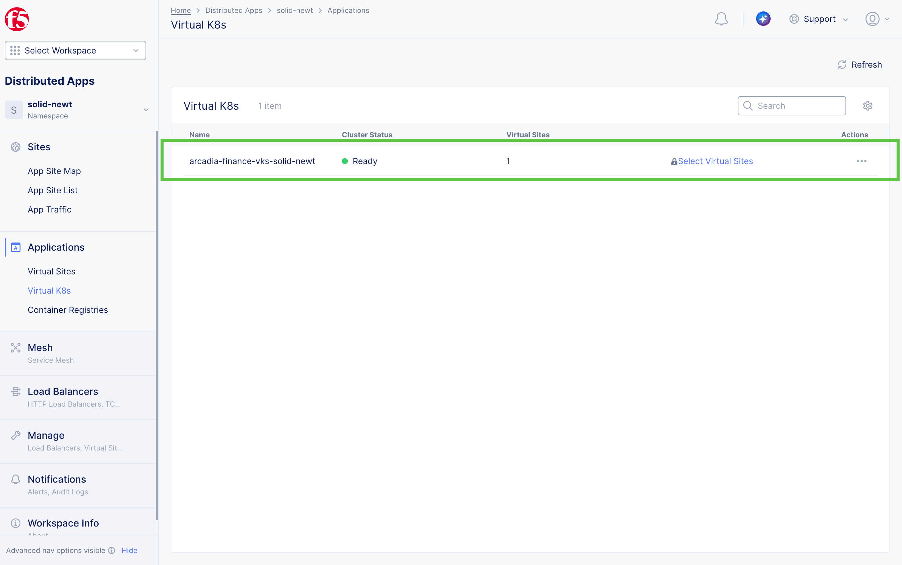

Create the Virtual Kubernetes environment
#########################################

1. In the F5 XC Console, open **Applications** and select **Virtual K8s (1)**. Select **Add Virtual K8s (2)**.

 
2. Enter ``arcadia-finance-vks-$$namespace$$`` as the **Name (1)**. Under **Virtual Sites**, select ``$$namespace$$/arcadia-finance-vsite`` and then select **Add Item (2)**. Leave **Choose Service Isolation** set to **Disabled** and **Default Workload Flavor** unselected. Select **Add Virtual K8s (4)** to create the cluster.

3. Wait while the Virtual K8s cluster is created. Verify that ``arcadia-finance-vks-$$namespace$$`` appears in the list and that its **Cluster Status** changes to **Ready**.

