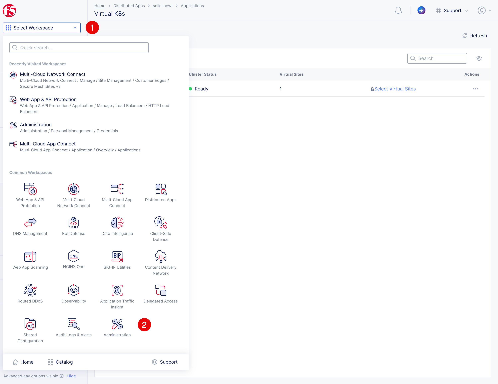
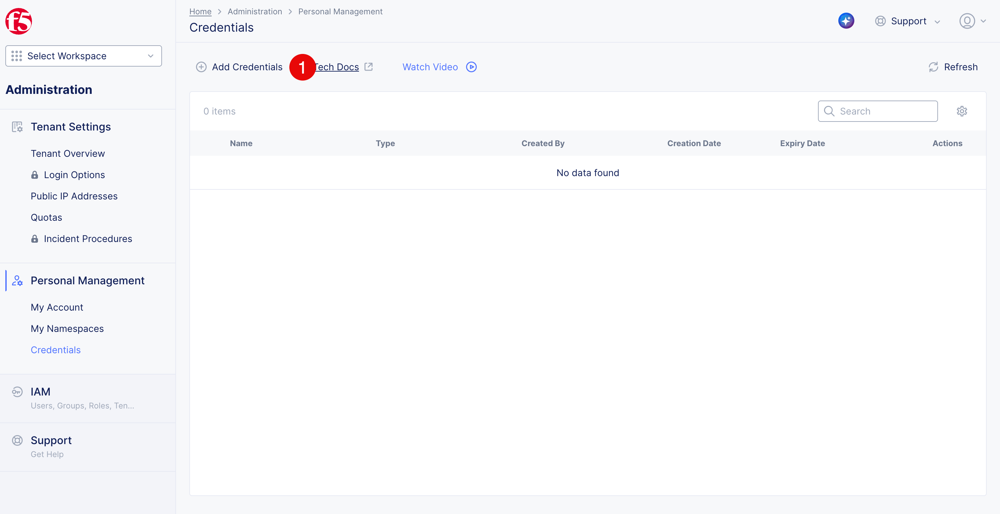
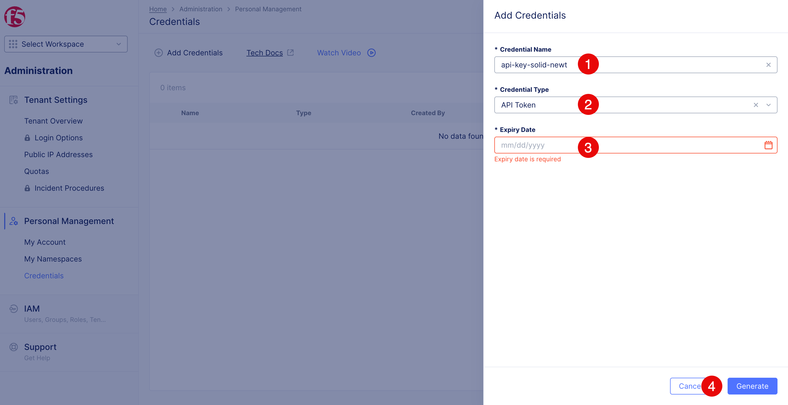
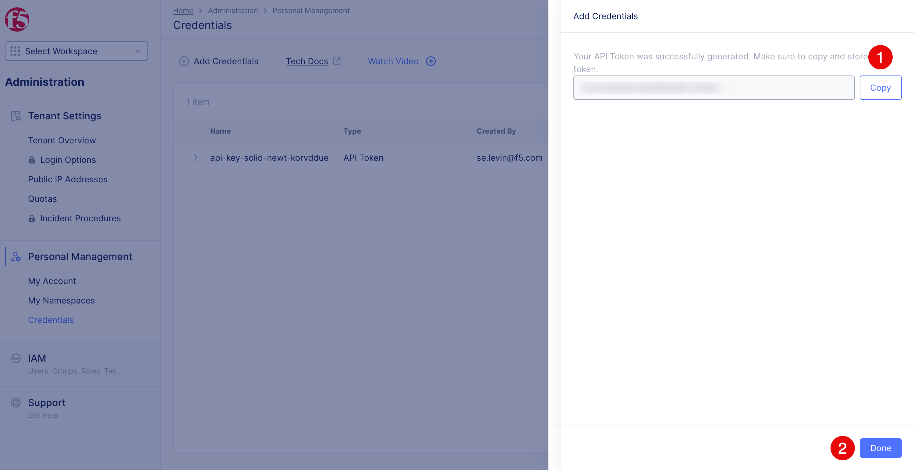
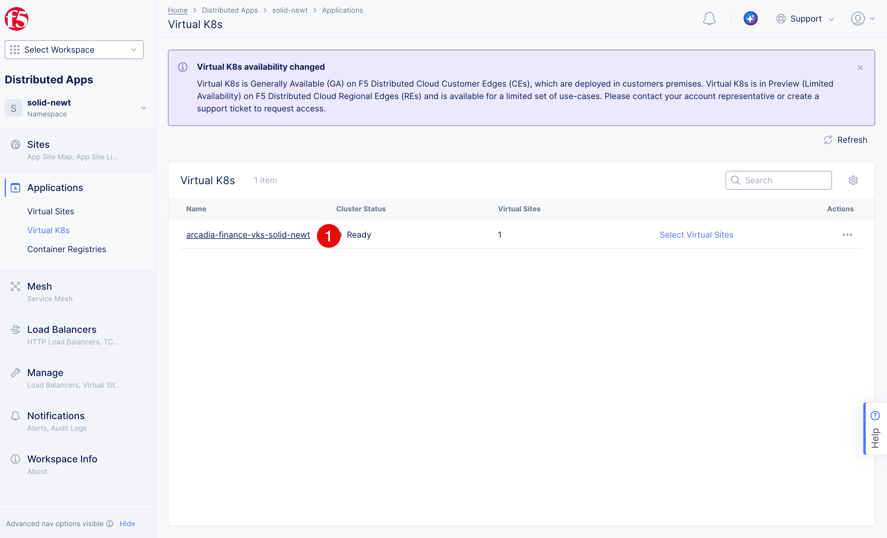
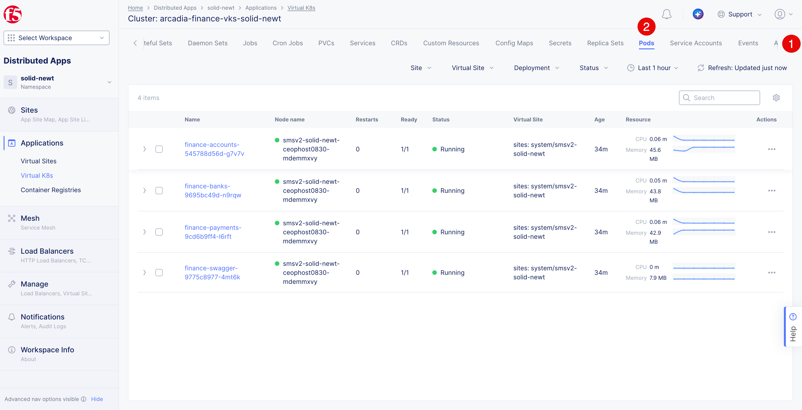

Deploy the Arcadia Finance Open Banking API
############################################

Create an F5 XC API token
=========================

.. note::

   The following steps create a short-lived API token that the jump host can use to request the vK8s kubeconfig through the F5 XC API. The token is valid for one day and will be revoked automatically after the workshop.

1. In the F5 XC Console, select **Select Workspace (1)** and switch to **Administration (2)**.

2. Click **Add Credentials (1)**. You will deploy the Kubernetes resources from the jump host using the ``kubectl`` utility. The utility requires a kubeconfig, which you will generate and download through an F5 XC API call.

3. Enter ``api-key-$$namespace$$`` as the **Credentials Name (1)**. Select **API Token (2)** as the **Credentials Type**. For the **Expiry Date (3)**, select the next day. Click **Create (4)** to create the API token.

4. Click **Copy (1)** to copy the generated token. Make sure you save it securely before closing the dialog because XC does not display the token again. Click **Done (2)** to close the dialog.

.. warning::

   The API token inherits your user permissions. Treat it as a secret and do
   not save it in source control. It will be revoked automatically after the
   workshop.

Generate the vK8s kubeconfig on the jump host
=============================================

1. Open the **Web Shell** on the **Jumphost** component of the **UDF**:
   .. image:: ../../img/udf-jh-webshell.png
      :align: center
.. note::
   Use the API token from the previous section to request a short-lived kubeconfig
   directly from F5 XC. The vK8s object and Kubernetes workloads belong to your
   assigned ``$$namespace$$`` application namespace. The generated commands save
   the kubeconfig on the jump host and set that namespace as the current kubectl
   context; no SCP or browser download is required.

2. Enter the required XC API token from the previous section.
3. Enter the vK8s object name you created. The predefined tenant, expiration,
   and assigned namespace are supplied automatically.
4. Select **Generate**.
5. Copy the generated commands and run them on the jump host.

.. react:: CodeGenerator
   :language: console
   :parameters: [{"name":"tenant","title":"XC tenant name","default":"labs-msp-c-secure","readonly":true},{"name":"apiToken","title":"XC API token","type":"text","required":true},{"name":"vk8s","title":"Virtual K8s name","default":"arcadia-finance-vks-$$namespace$$","required":true},{"name":"expiry","title":"Kubeconfig expiry (days)","default":"1","readonly":true}]

   XC_API_TOKEN='$$apiToken$$'
   export HOME="${HOME:-$(getent passwd "$(id -u)" | cut -d: -f6)}"
   umask 077
   mkdir -p "$HOME/.kube"
   response_file="$(mktemp)"
   trap 'rm -f "$response_file"; unset XC_API_TOKEN' EXIT

   curl --fail-with-body --silent --show-error \
     --request POST \
     "https://$$tenant$$.console.ves.volterra.io/api/web/namespaces/system/api_credentials" \
     --header "Authorization: APIToken ${XC_API_TOKEN}" \
     --header "Content-Type: application/json" \
     --data '{
       "namespace": "system",
       "name": "arcadia-vk8s-'"$(date +%s)"'",
       "spec": {
         "type": "KUBE_CONFIG",
         "virtual_k8s_namespace": "$$namespace$$",
         "virtual_k8s_name": "$$vk8s$$"
       },
       "expiration_days": $$expiry$$
     }' > "$response_file"

   jq -er '.data' "$response_file" | base64 --decode > "$HOME/.kube/config"
   chmod 600 "$HOME/.kube/config"
   export KUBECONFIG="$HOME/.kube/config"
   kubectl config set-context --current --namespace="$$namespace$$"
   kubectl config view --minify
   kubectl cluster-info
   kubectl get pods --namespace="$$namespace$$"

.. warning::

   The generated code contains the API token, and the kubeconfig is also a
   credential. Do not save or share the generated code.

Deploy the API services and Swagger UI from the CLI
===================================================

The Arcadia Finance Opem Banking API consists of three microservices. The additional Swagger UI is deployed to ease testing and exploration of the API. The following table lists the services, their paths, and the public image names.

.. table:: Required Arcadia Finance Open Banking API services
   :widths: auto

   ================  =====================  =====================================================================
   Service           Paths                  Public image
   ================  =====================  =====================================================================
   Banks             ``/banks``             ``docker.io/interestingstorage/partner-spec-security:banks-latest``
   Accounts          ``/accounts``          ``docker.io/interestingstorage/partner-spec-security:accounts-latest``
   Payments          ``/payments``          ``docker.io/interestingstorage/partner-spec-security:payments-latest``
   Swagger UI        ``/swagger/``          ``docker.io/interestingstorage/partner-spec-security:swagger-latest``
   ================  =====================  =====================================================================

Continue in the same jump-host terminal used in the previous section. The
``KUBECONFIG`` environment variable, vK8s connection, and ``$$namespace$$``
current-context namespace are already configured and verified.

1. Create and open a file named ``finance.yaml``:

   .. code-block:: console
      touch finance.yaml
      nano finance.yaml

   Paste the following manifest, which defines all four Deployments and
   ClusterIP Services:

   .. code-block:: yaml
      apiVersion: apps/v1
      kind: Deployment
      metadata:
        name: finance-banks
      spec:
        replicas: 1
        selector:
          matchLabels:
            app: finance-banks
        template:
          metadata:
            labels:
              app: finance-banks
          spec:
            containers:
              - name: banks
                image: docker.io/interestingstorage/partner-spec-security:banks-latest
                imagePullPolicy: Always
                ports:
                  - name: http
                    containerPort: 8080
      ---
      apiVersion: v1
      kind: Service
      metadata:
        name: finance-banks
      spec:
        selector:
          app: finance-banks
        ports:
          - name: http
            protocol: TCP
            port: 80
            targetPort: 8080
      ---
      apiVersion: apps/v1
      kind: Deployment
      metadata:
        name: finance-accounts
      spec:
        replicas: 1
        selector:
          matchLabels:
            app: finance-accounts
        template:
          metadata:
            labels:
              app: finance-accounts
          spec:
            containers:
              - name: accounts
                image: docker.io/interestingstorage/partner-spec-security:accounts-latest
                imagePullPolicy: Always
                ports:
                  - name: http
                    containerPort: 8080
      ---
      apiVersion: v1
      kind: Service
      metadata:
        name: finance-accounts
      spec:
        selector:
          app: finance-accounts
        ports:
          - name: http
            protocol: TCP
            port: 80
            targetPort: 8080
      ---
      apiVersion: apps/v1
      kind: Deployment
      metadata:
        name: finance-payments
      spec:
        replicas: 1
        selector:
          matchLabels:
            app: finance-payments
        template:
          metadata:
            labels:
              app: finance-payments
          spec:
            containers:
              - name: payments
                image: docker.io/interestingstorage/partner-spec-security:payments-latest
                imagePullPolicy: Always
                ports:
                  - name: http
                    containerPort: 8080
      ---
      apiVersion: v1
      kind: Service
      metadata:
        name: finance-payments
      spec:
        selector:
          app: finance-payments
        ports:
          - name: http
            protocol: TCP
            port: 80
            targetPort: 8080
      ---
      apiVersion: apps/v1
      kind: Deployment
      metadata:
        name: finance-swagger
      spec:
        replicas: 1
        selector:
          matchLabels:
            app: finance-swagger
        template:
          metadata:
            labels:
              app: finance-swagger
          spec:
            containers:
              - name: swagger-ui
                image: docker.io/interestingstorage/partner-spec-security:swagger-latest
                imagePullPolicy: Always
                ports:
                  - name: http
                    containerPort: 8080
      ---
      apiVersion: v1
      kind: Service
      metadata:
        name: finance-swagger
      spec:
        selector:
          app: finance-swagger
        ports:
          - name: http
            protocol: TCP
            port: 80
            targetPort: 8080

   After pasting the manifest, press ``Ctrl+X``, then ``Y``, and then ``Enter``
   to save the changes and exit nano.

2. Validate and deploy the manifest:

   .. code-block:: console
      kubectl apply --dry-run=server -f finance.yaml
      kubectl apply -f finance.yaml

3. Verify that the four Deployments and Services are created:
 
- Switch Current Workspace to **Distributed Apps**
- Select **Virtual K8s** in the *Applications* menu
- Click on ``arcadia-finance-vks-$$namespace$$`` to open the vK8s details`

Scroll the toolbar (1) to the right and select **Pods (2)**. The four Pods should be listed with **Running** status.

