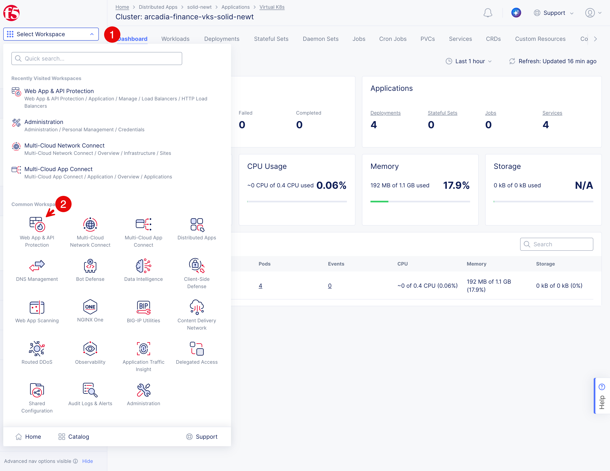
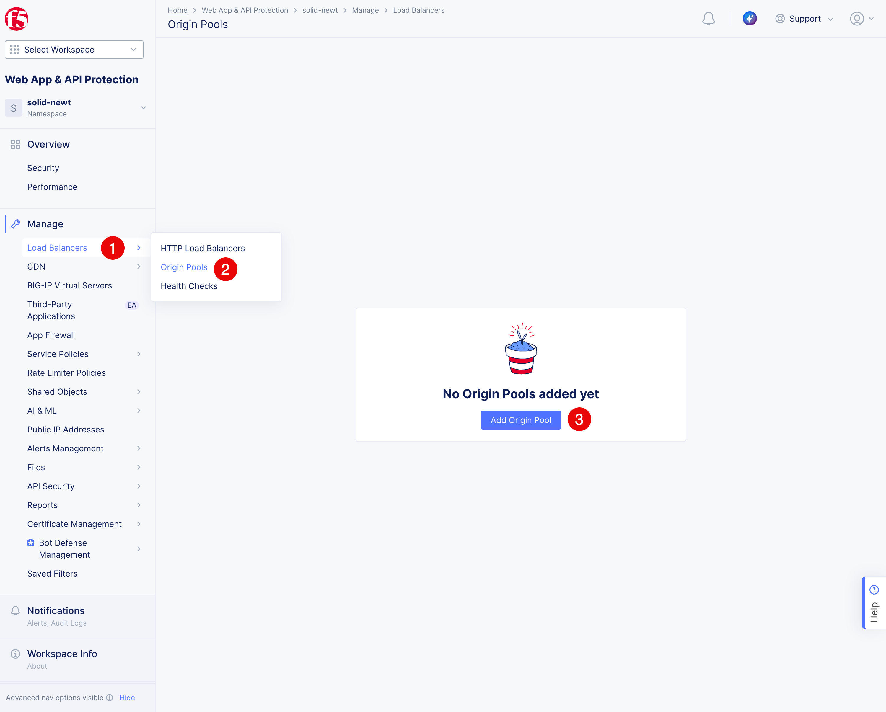
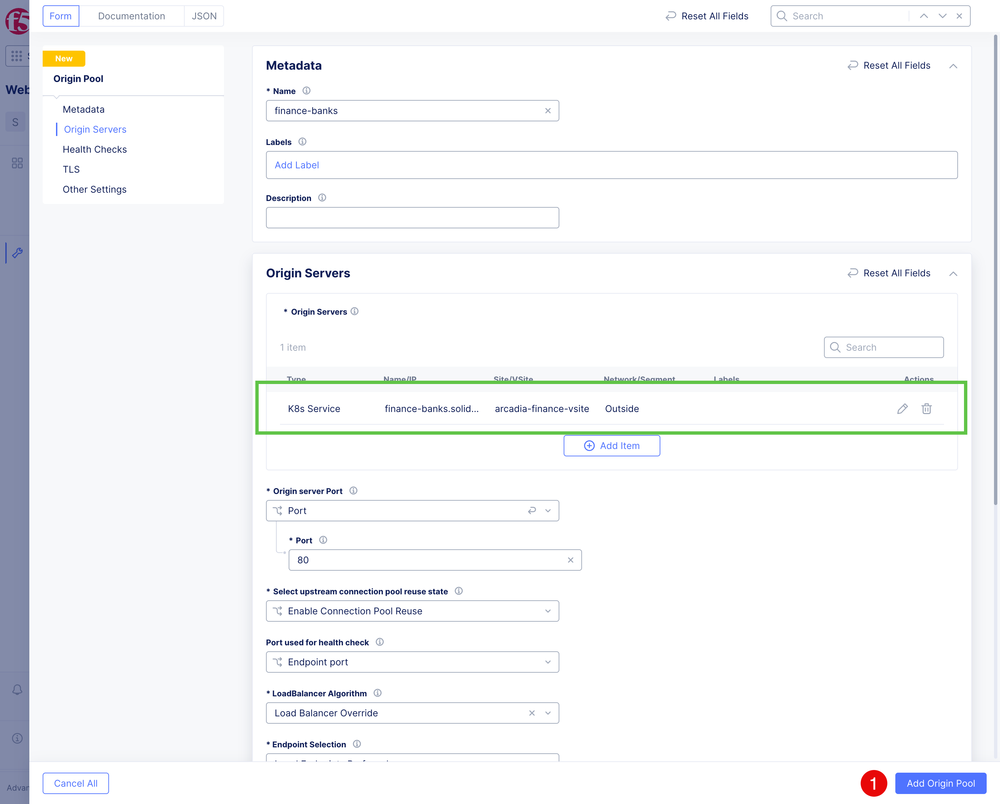
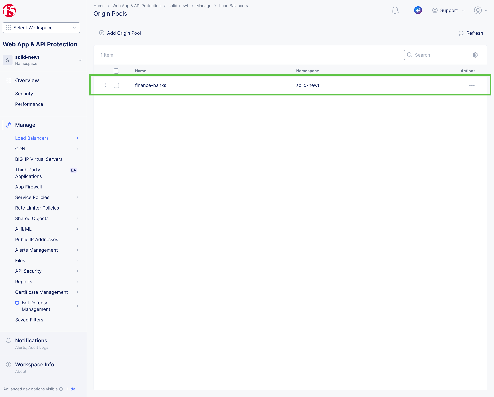

Publish and verify the Arcadia Finance Open Banking API and Swagger UI
######################################################################

Origin Pools
=========================
Create a separate origin pool for each Kubernetes Service, then use HTTP routes
to expose the three APIs and Swagger UI through one domain.

1. Click **Select Workspace (1)** and select **Web App & API Protection (2)**.

2. Click **Load Balancers (1)** > **Origin Pools (2)** > **Add Origin Pool (3)**.

3. Enter the name for the first origin pool in the **Name (1)** field ``finance-banks``. Change **Port (2)** to ``80``. Click **Add Item (3)** on the **Origin Servers** group.
   .. image:: ../../img/web-app-lb-op-details-1.png
      :align: center

4. Adding of the Origin Pool has several steps:
  
  * Select **K8s Service Name of Origin Server on Given Sites (1)**. 
  * Enter the Kubernetes service name ``finance-banks.$$namespace$$`` in the **Service Name (2)** field. 
  * Set Protocol to **TCP(3)**. Select the **Virtual Site (4)** and then select your virtual site ``$$namespace/arcadia-finance-vsite`` **(5)**. 
  * Change network to **Outside network (6)**. Finally press **Apply (7)** to add the origin server to the pool.
   .. image:: ../../img/web-app-lb-op-details-2.png
      :align: center

.. Note::
   The Kubernetes service name is the same as the service name in the vK8s cluster, with the namespace appended. For example, the Banks service is named ``finance-banks`` in the vK8s cluster and ``finance-banks.$$namespace$$`` in the origin pool.

5. The **Origin Server** will be added. Click **Add Origin Pool (1)** to create the origin pool.

6. Origin pool ``finance-banks`` should be listed:.

7. Repeat steps 3-5 to create the following four origin pools (the ``finance-banks`` pool is already created):

   .. table:: Required origin pools
      :widths: auto

      =================================  =============================================
      Origin pool                        Kubernetes service name
      =================================  =============================================
      ``finance-banks``              ``finance-banks.$$namespace$$``
      ``finance-accounts``           ``finance-accounts.$$namespace$$``
      ``finance-payments``           ``finance-payments.$$namespace$$``
      ``finance-swagger``            ``finance-swagger.$$namespace$$``
      =================================  =============================================

The list of the pools hould look like this:
   .. image:: ../../img/web-app-lb-op-result-2.png
      :align: center

Load Balancer
=============
1. Click **Load Balancers (1)** > **HTTP Load Balancers (2)** > **Add HTTP Load Balancer (3)**.
   .. image:: ../../img/web-app-lb-create.png
      :align: center

2. Enter ``arcadia-finance`` in the **Name (1)** field. Add the domain ``$$namespace$$.spec-security.f5se.com`` in **Domains (2)**. Select **HTTPS with Automatic Certificate (3)** as the load balancer type, enable **HTTP Redirect to HTTPS (4)**, and click **Configure (5)** in the **Routes** section.
   .. image:: ../../img/web-app-lb-details-1.png
      :align: center

3. Click **Add Item (1)** to add a route.

   .. image:: ../../img/web-app-lb-details-2.png
      :align: center

4. Select **Simple Route (2)** as the route type. **HTTP Method (3)** should be **ANY**. Switch **Path Match** to **Prefix (3)** and enter ``/banks`` in the **Prefix (4)** field. In **Origin Pools**, click **Add Item (5)** and select ``finance-banks``. Click **Apply (6)** to add the route.

   .. image:: ../../img/web-app-lb-details-3.png
      :align: center

5. Repeat these steps to add the remaining routes to the HTTP load balancer (the route for ``/banks`` is already created):

   .. table:: Required HTTP routes
      :widths: auto

      ====================  ============================
      Path prefix           Origin pool
      ====================  ============================
      ``/banks``            ``finance-banks``
      ``/accounts``         ``finance-accounts``
      ``/payments``         ``finance-payments``
      ``/swagger``          ``finance-swagger``
      ====================  ============================

   .. note::            
      Prefix matching also sends nested resources, such as ``/accounts/{accountId}/balance``, to the correct service.

6. The list of routes should look like below. Click **Apply (1)** to save the routes configuration.
   .. image:: ../../img/web-app-lb-details-4.png
      :align: center

7. Keep other settings untouched for now. As **Routes** are ready, click **Add HTTP Load Balancer (1)** to create the load balancer.
   .. image:: ../../img/web-app-lb-details-5.png
      :align: center

8. Wait for the **Provisioning** to be complete and **Validity** changes to **Valid**. The ready load balancer should look like this:
   .. image:: ../../img/web-app-lb-result.png
      :align: center

.. note::
   Provisioning tmaight take some time as the SSL certificate is being generated.

8. Verify that the load balancer reaches all four services:

   .. code-block:: console
      export BASE_URL="https://$$namespace$$.spec-security.f5se.com"
      curl -i "${BASE_URL}/banks"
      curl -i "${BASE_URL}/accounts"
      curl -i "${BASE_URL}/payments"
      curl -I "${BASE_URL}/swagger/"

   Verify for each request that the response is a normal application status: ``200``. The Swagger UI service returns a redirect to the interactive documentation.

9.  Open the interactive Swagger UI at :ext_link:`https://$$namespace$$.spec-security.f5se.com/swagger/`. Expand an operation, select **Try it out**, and then select **Execute**. Swagger UI sends the request to the matching API route on the same domain.