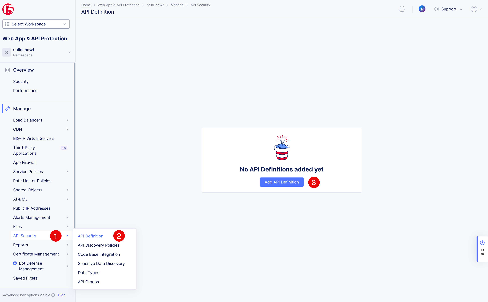
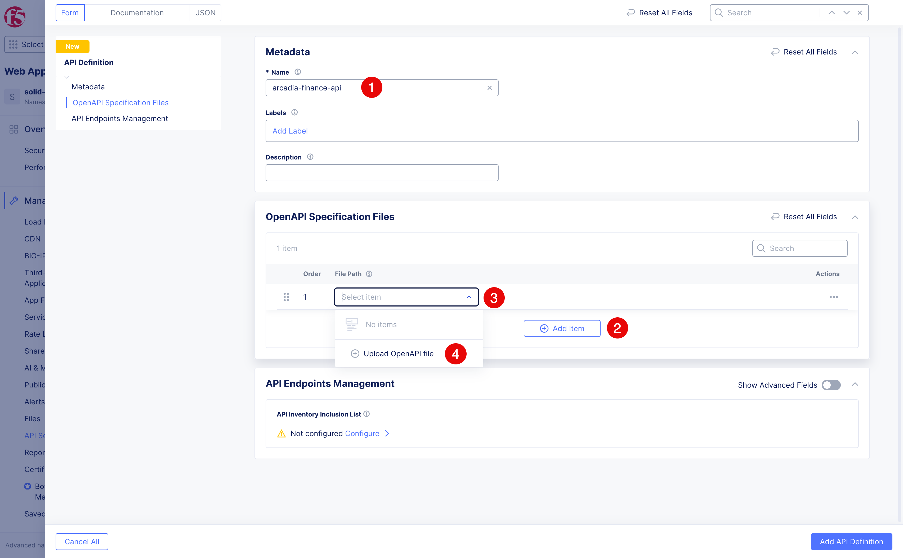
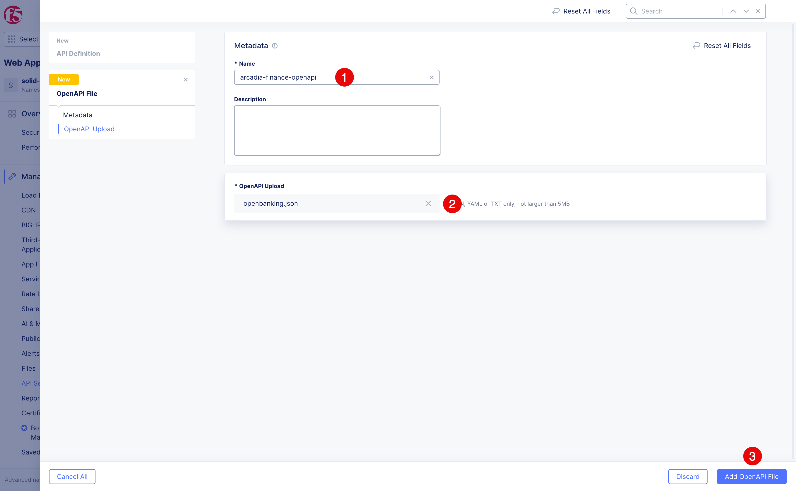
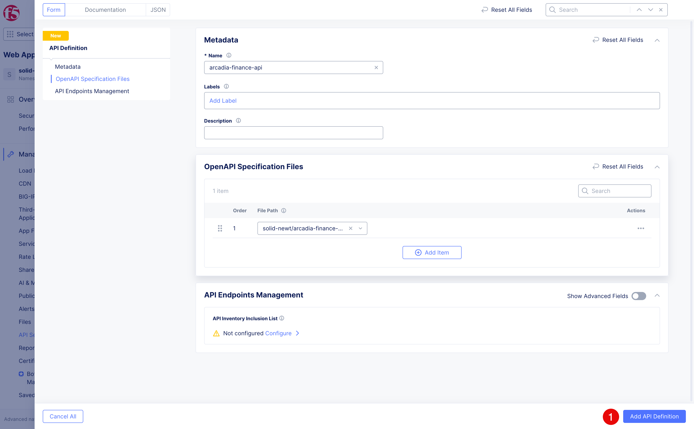
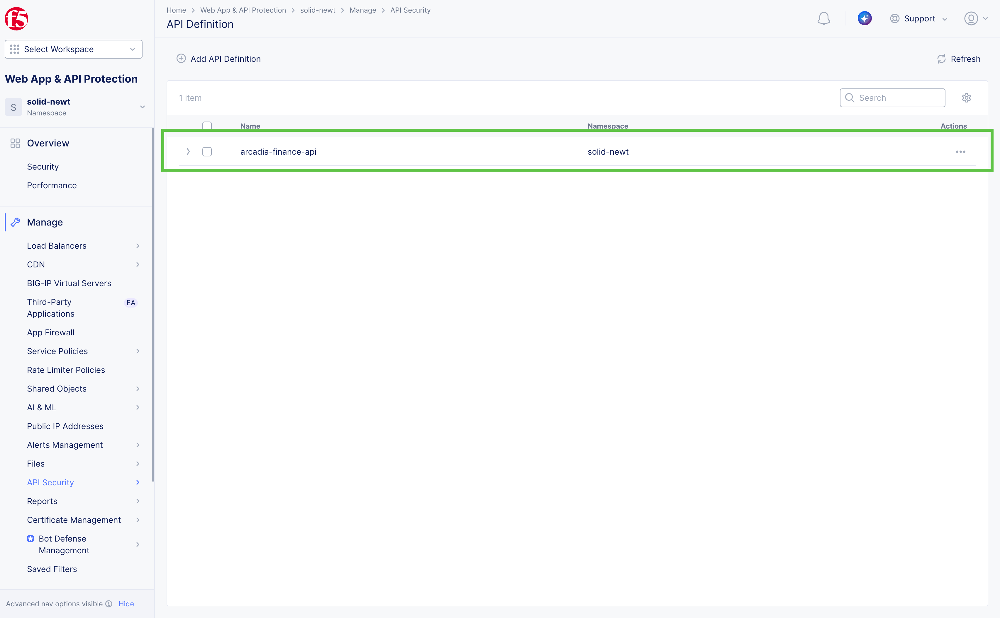
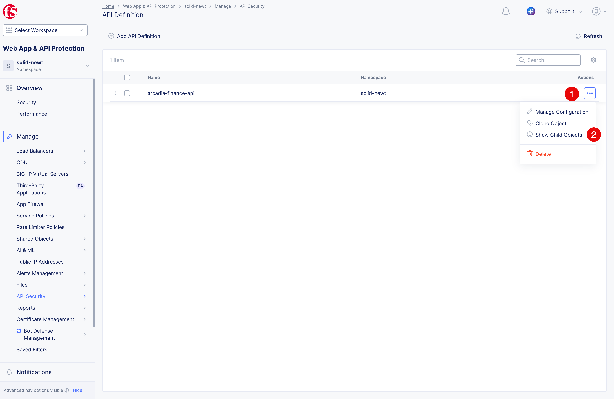
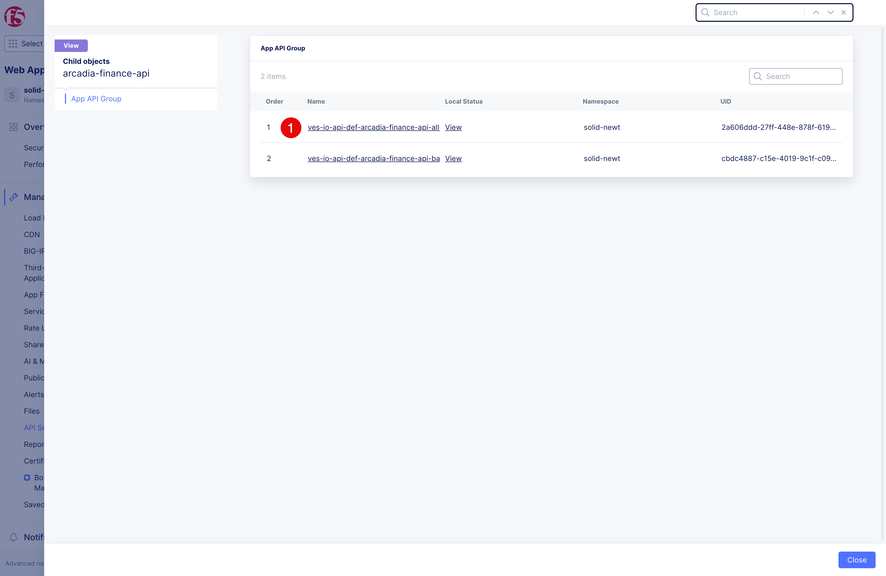
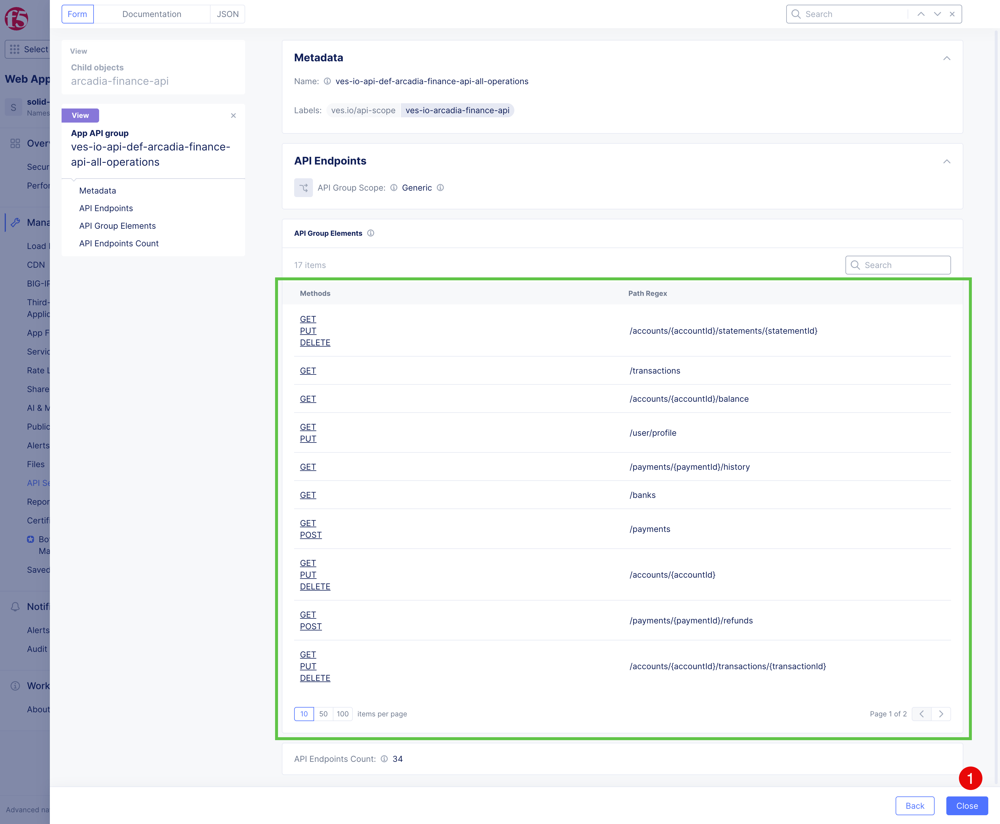

Import the Arcadia Finance Open Banking API definition
######################################################

1. Download the Open Banking API definition from the lab files.

.. react:: Download
   :path: ../../resources/openbanking.json
   :title: Arcadia Finance Open Banking API definition
   :text: Download openbanking.json

2. Navigate to **API Security (1)** > **API Definition (2)**, and then click **Add API Definition (3)**.

3. In the **Name (1)** field, enter ``arcadia-finance-api``. Click **Add Item (2)**, open the **File Path (3)** drop-down menu, and select **Upload OpenAPI File (4)**.

   
4. In the **Name (1)** field, enter ``arcadia-finance-openapi``. Upload the ``openbanking.json`` file that you just downloaded **(2)**, and then click **Add OpenAPI File (3)**.

5. Click **Add API Definition (1)** to save the API definition.

6. Verify that the API definition was imported successfully and appears in the list of API definitions.

7. Click **... (1)** next to the API definition you just added, and then click **Show Child Objects (2)**.

8. Click **(1)** next to the child object you want to view.

9. Observe the imported API Group Elements. Click **Close (1)** to return to the list of child **API Definitions**.
