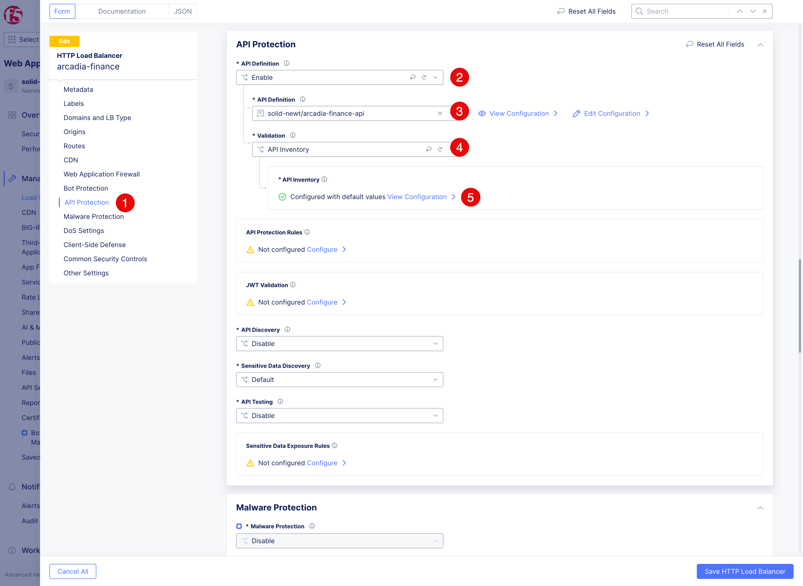
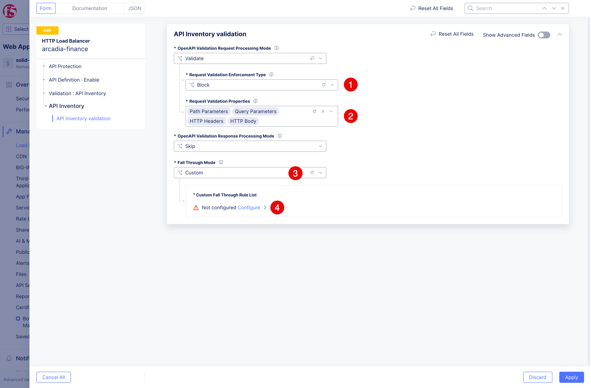
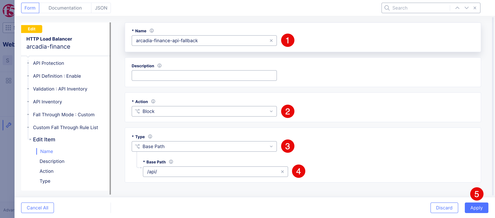
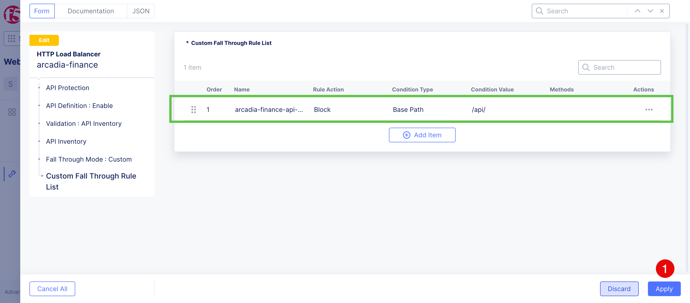
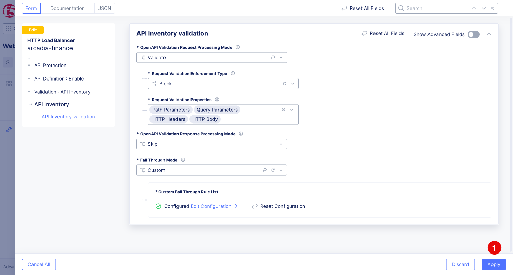
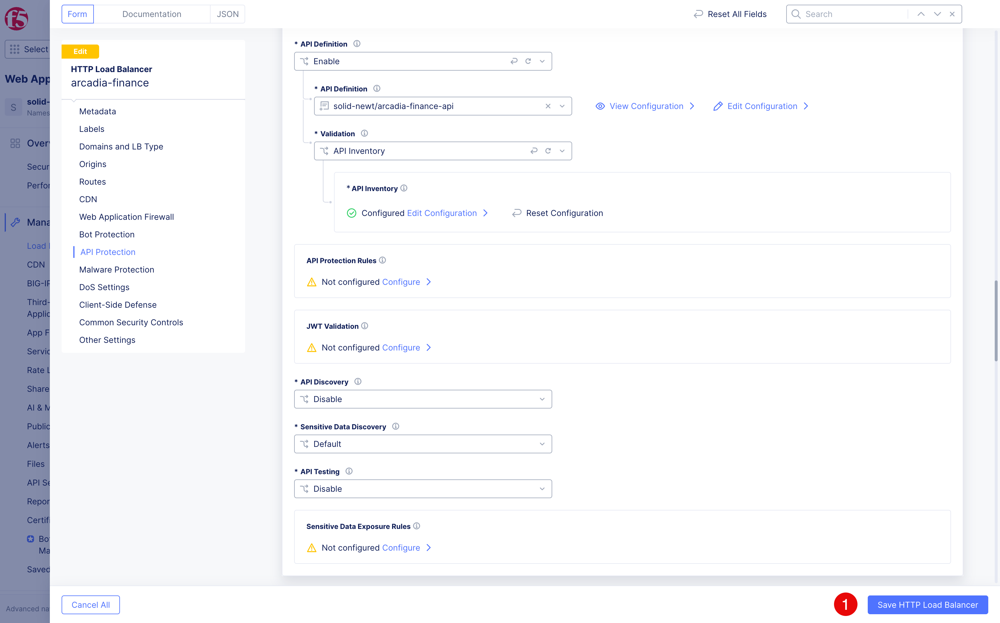

Enforce the Arcadia Finance Open Banking API OpenAPI schema
###########################################################

Configure tha API Protection
=============================
1. Before enabling API Protection, establish that the origin currently handles both documented and undocumented paths:

   .. code-block:: console
      BASE="https://$$namespace$$.spec-security.f5se.com"
      curl -i "$BASE/api/banks"
      echo 
      curl -i "$BASE/api/banks/unknown-test/extra"
      echo 
      curl -i -X DELETE "$BASE/api/banks"

   Record both baseline status codes and response bodies. The undocumented path will return an error ``400``; after protection is enabled, F5 XC must reject it before it reaches the origin. 

2. Open Edit configoration for the arcadia finance HTTP load balancer.

3. Click **Api Protection (1)**. Select **Enable** for **API Definition (2)**, choose just 
   created **API Definition: (3)** ``$$namespace$$/arcadia-finance-api``, and select **API Inventory** 
   for **Validation (4)**. Click on **View Configuration > (5)** to set the request fallback to block.

4. First, select **Block** for **Request Validation Enforcement Type (1)**. Then add **HTTP Body** to 
   **Request Validation Properties (2)**. In **Fallback Through Mode (3)** select **Custom**. 
   Click on **Configure > (4)** to set custom rules.

5. In the appeared dialog click **Add Item** and then fill in the form. Specify ``arcadia-finance-api-fallback`` for 
   the **Name (1)**. Select **Block** for **Action (2)**, **Base Path (3)** for **Type**. Specify ``/api/``
   as the **Base Path (4)**. This scopes fallback enforcement to the published API and leaves paths such as
   ``/swagger`` and the Bot Defense JavaScript download path outside API validation. Click **Apply (5)** to save the rule.

6. The custom rule will be added. Click **Apply (1)** to save the configuration.

7. Click **Apply (1)** to save the API Inventory validation configuration.

8. Click **Save HTTP Load Balancer (1)** to save the updates.

Test the API Protection
=========================
1. Confirm a documented endpoint remains available:

   .. code-block:: console
      curl -i "$BASE/api/banks"

2. Confirm an unknown endpoint is rejected by F5 XC:

   .. code-block:: console
      curl -i "$BASE/api/banks/unknown-test/extra"

3. Send a method not defined for a known endpoint and verify enforcement:

   .. code-block:: console
      curl -i -X DELETE "$BASE/api/banks"

4.  Send a valid payment body and confirm it passes API validation:

   .. code-block:: console
      curl -i -X POST "$BASE/api/payments" \
        -H 'Content-Type: application/json' \
        -d '{"amount":100.50,"currency":"EUR","recipient":{"name":"Lab Recipient","accountNumber":"12345678","bankCode":"LABBANK1"}}'

5. Send a body with schema type violations and confirm it is rejected:

   .. code-block:: console
      curl -i -X POST "$BASE/api/payments" \
        -H 'Content-Type: application/json' \
        -d '{"amount":"not-a-number","currency":123,"recipient":false}'