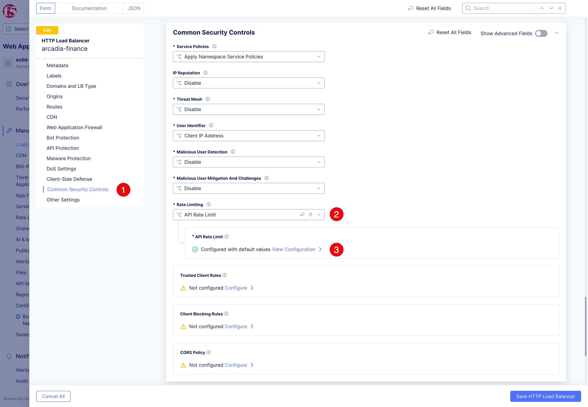
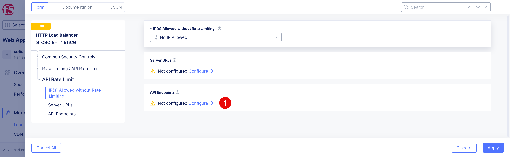
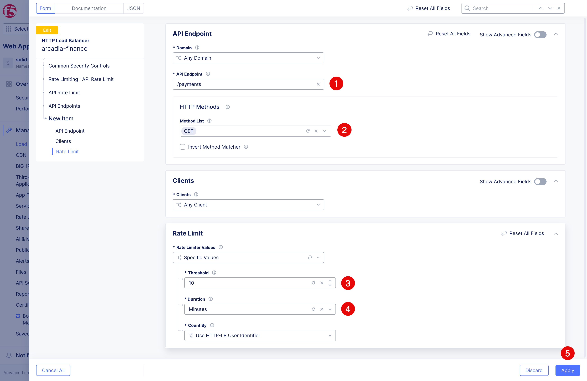
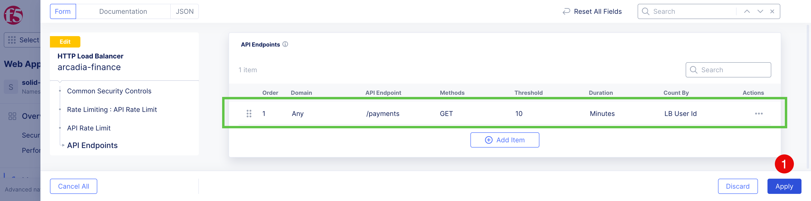
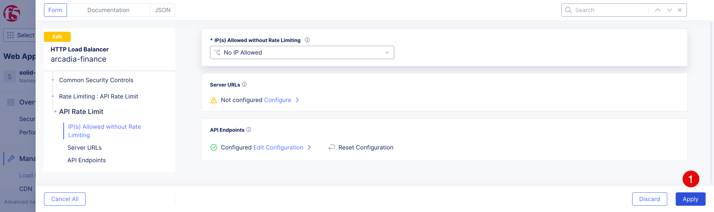
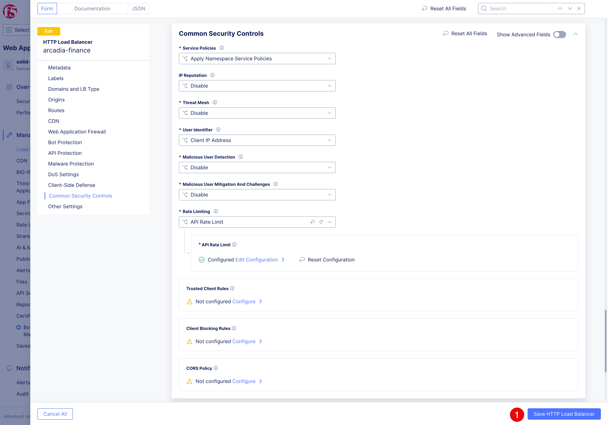

Apply and test API rate limiting
################################

This exercise adapts the pre- and post-mitigation rate-limit test from the source API Security labs. Protect the account-list operation from a looping or excessively active client.

Baseline test
~~~~~~~~~~~~~

1. Send more than ten requests within one minute:

   .. code-block:: console
      BASE="https://$$namespace$$.spec-security.f5se.com"
      for i in $(seq 1 30); do
        code=$(curl -sS -o /dev/null -w '%{http_code}' "$BASE/payments")
        printf 'request=%02d status=%s\n' "$i" "$code"
      done

2. Before rate limiting is enabled, confirm that the requests receive the normal application status.

Configure the control
~~~~~~~~~~~~~~~~~~~~~

1. Open the configuration editor for the ``arcadia-finance`` HTTP load balancer.
   
2. Click **Common Security Controls (1)** > **Rate Limiting** > **API Rate Limit (2)**. Click **View Configuration > (3)** to open the configuration panel.

3. Click **Configure (1)** to add an **API Endpoints** rule.

4. Add new rule, clicking the **Add Item** button. In the appeared dialog fill in the form and click the **Apply (5)** button to save the rule.

   .. table:: Required API rate-limit settings
      :widths: auto

      ==================  =====================
      Setting             Value
      ==================  =====================
      API endpoint (1)        ``/payments``
      Method list (2)         GET
      Threshold (3)           ``10``
      Duration (4)            Minute
      ==================  =====================

5. Rate limit rule will be added. Click **Apply (1)** to save the configuration.

6. API Endpoints are configured. Click **Apply (1)** to save the API Endpoints configuration.

7. Click **Save HTTP Load Balancer (1)** to save the updates.

Mitigation test
~~~~~~~~~~~~~~~

Run the test again:
   .. code-block:: console
      BASE="https://$$namespace$$.spec-security.f5se.com"
      for i in $(seq 1 30); do
        code=$(curl -sS -o /dev/null -w '%{http_code}' "$BASE/payments")
        printf 'request=%02d status=%s\n' "$i" "$code"
      done

Notice how first ten requests are successful, but subsequent requests are rejected with a ``429`` status code.