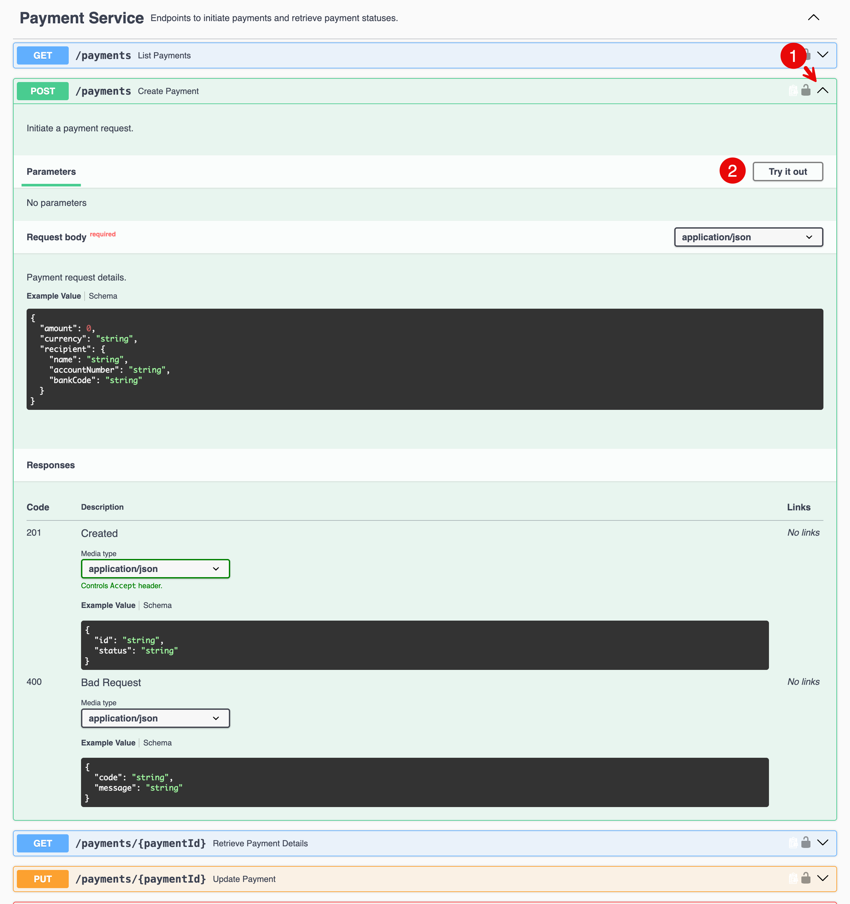

Compare automated and browser traffic
#####################################

1. Send repeated scripted POST requests to the same protected API endpoint.
  
   .. code-block:: console
      BASE="https://$$namespace$$.spec-security.f5se.com"
      API="$BASE/api/payments"
      for i in $(seq 1 20); do
        code=$(curl -sS -o /dev/null -w '%{http_code}' -X POST \
          -H 'Content-Type: application/json' \
          -d '{"amount":100.50,"currency":"EUR","recipient":{"name":"Lab Recipient","accountNumber":"12345678","bankCode":"LABBANK1"}}' \
          "$API")
        printf 'request=%02d status=%s\n' "$i" "$code"
      done

Note, how the response is different.

2. Now lets see how the legitimate Web App will call the api. Open the Swagger UI at :ext_link:`https://$$namespace$$.spec-security.f5se.com/swagger/`. Expand **payments POST (1)** endpoint 
   and click on **Try it out** button.

3. Paste the same test request body as the scripted request **(1)** and click **Execute (2)** button.

   .. code-block:: json
      {
        "amount": 100.50,
        "currency": "EUR",
        "recipient": {
          "name": "Lab Recipient",
          "accountNumber": "12345678",
          "bankCode": "LABBANK1"
        }
      }

   You should observe that the response status is `201 Created`, indicating that the Web App successfully called the API, whereas the automated scripts were blocked.

   .. image:: ../../img/swagger-2.png
      ::align: center
