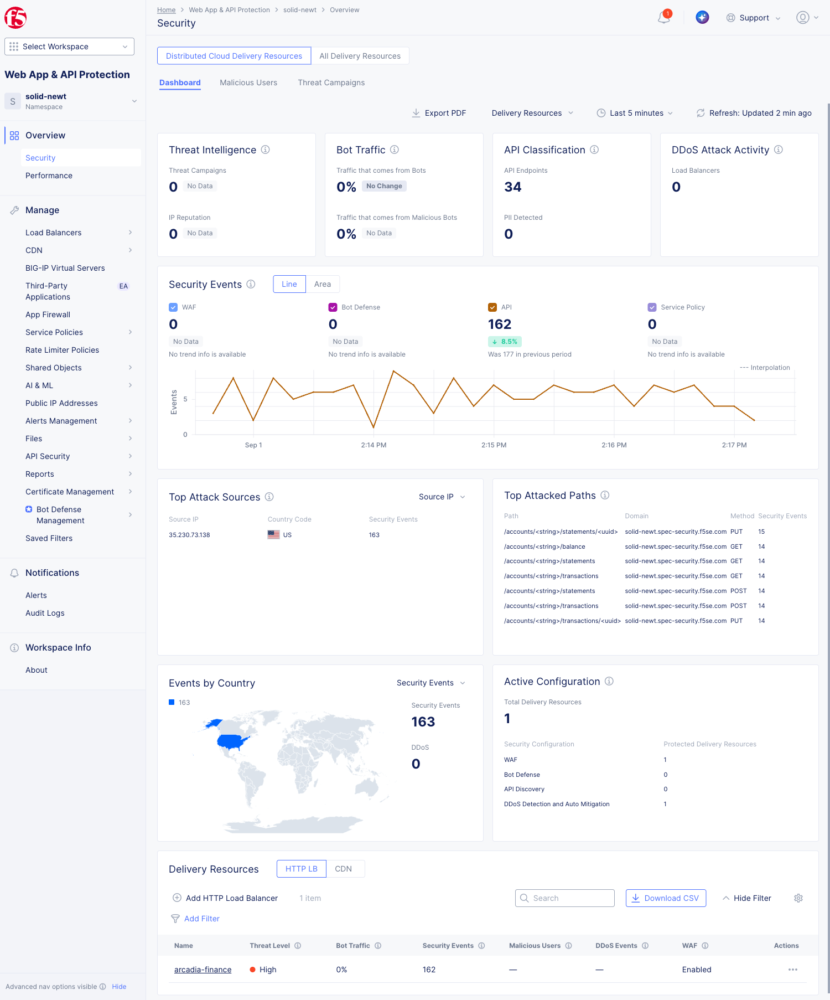
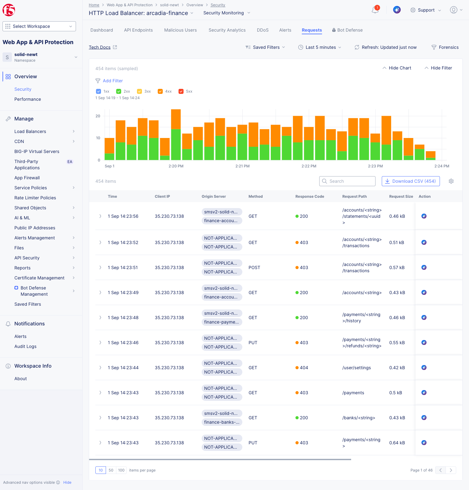
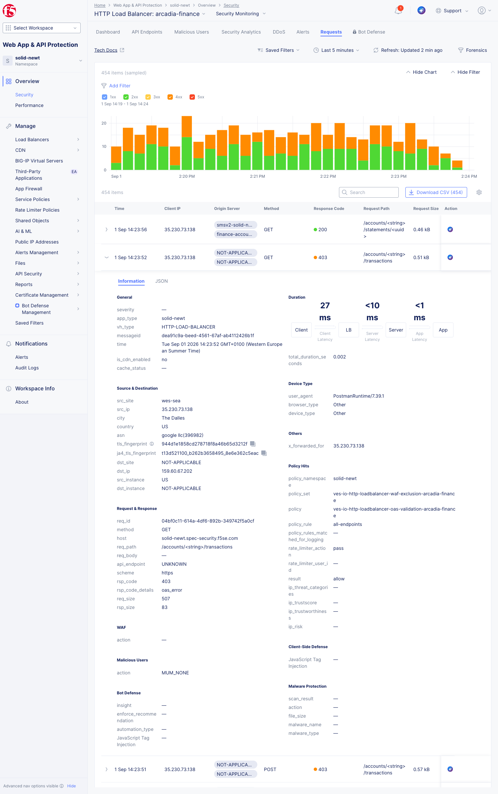

Review the Requests dashboard
#############################

Use the Requests dashboard to review traffic generated during the WAF, API Security, and Bot Defense exercises.

1. In **Web App & API Protection**, go to **Overview** > **Security**.

2. In the **Delivery Resources** dection, click the ``arcadia-finance`` HTTP load balancer.
3. Open the **Requests** tab.

4. Open the blcoked request and see the request information
