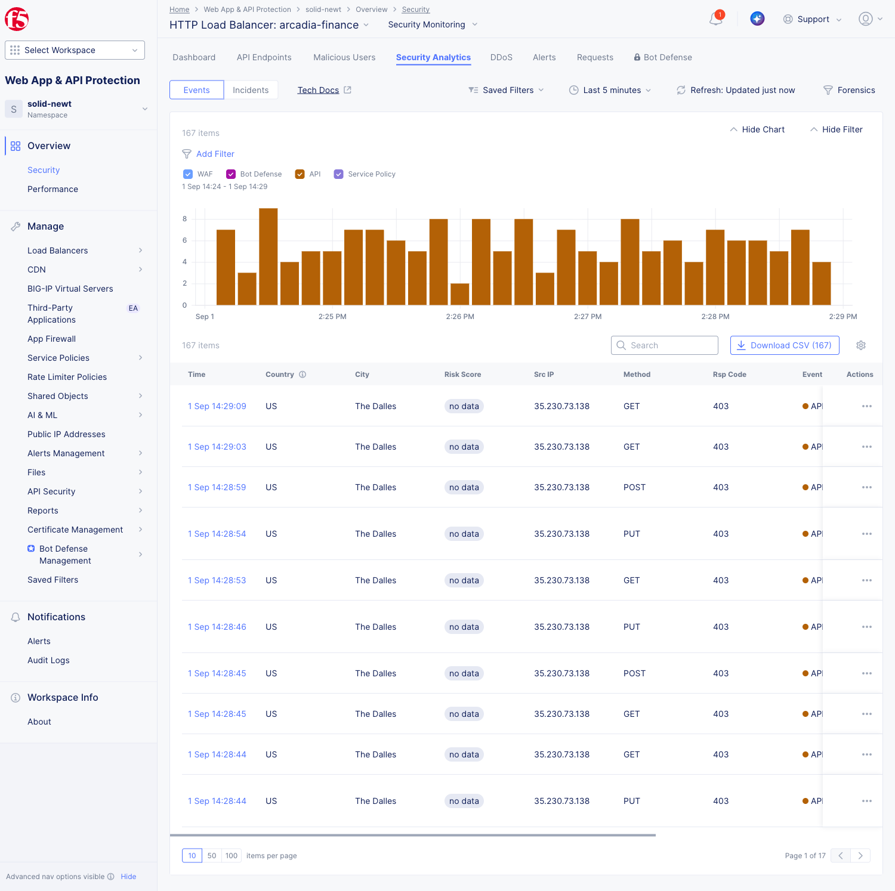
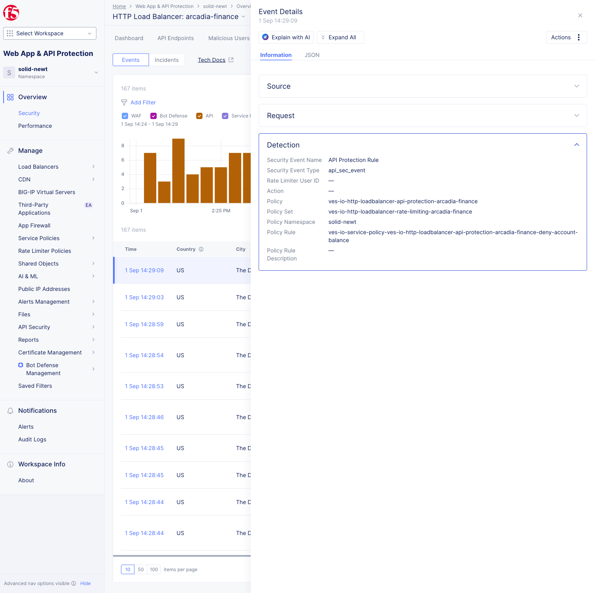

Investigate security events
###########################

Use Security Analytics to understand why requests were allowed, flagged, rate limited, or blocked.

1. Open the Security Analytics dashboard.

2. Click on a security event to view its details.
3. Open **Detection** group

Notice the Policy Rule used to detect and block the request.
